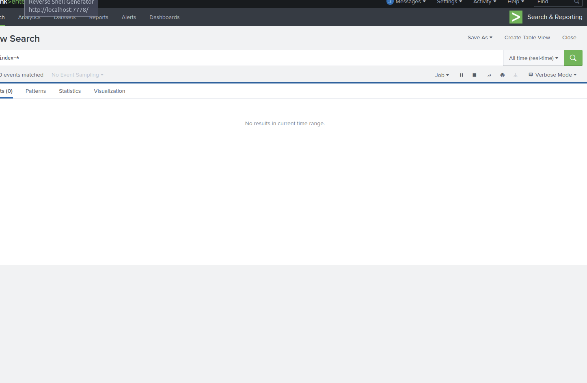

# INV-001 — Windows Failed Logon Investigation

## Alert
Multiple Windows Event ID 4625 (Failed Logon) events detected.

## What Happened
Repeated failed login attempts were observed against <USERNAME> on <HOSTNAME> from <SOURCE_IP>.

## Why This Matters
Repeated authentication failures may indicate brute force or password spraying activity.

## Evidence
- Event ID 4625 observed multiple times
- Source IP: <SOURCE_IP>
- Target account: <USERNAME>

## MITRE ATT&CK
T1110 — Brute Force

## Decision
Escalate: <Yes/No>

## Screenshots
Add images to the screenshots folder and they will render here.

